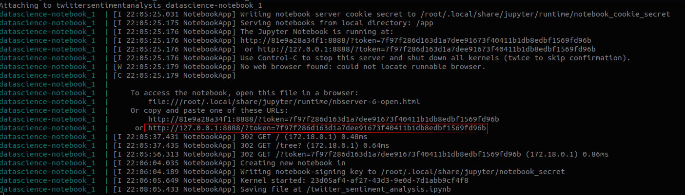

# Twitter Sentiment Analysis

## Project Informations

### About
The final objective is: development of a machine learning model for classifying hatred speach based in a given [dataset](https://www.kaggle.com/arkhoshghalb/twitter-sentiment-analysis-hatred-speech#train.csv).  

### How to execute
Prerequisites: [Docker](https://docs.docker.com/).  
  
**First step**: build the container. _It might need sudo command before it_  
``` $ docker-compose build ```  
or  
``` $ sudo docker-compose build ```  

**Second step**: start the container. _It might need sudo command before it_.  
``` $ docker-compose up ```  
or  
``` $ sudo docker-compose up ```  

**Third step**: after starting the container a log message like that will show up.  
  

**Fourth step**: Copy the log similiar to the highlighted on the image above and paste it on your browser.  _This specific link is necessary due to access token required for jupyter notebook initialization_

**Fifth step**: Access the ```twitter_sentiment_analysis.ipynb``` file on jupyter notebook dashboard.  

**Sixth step**: Navigate to _cell_ option and choose the option _"Run All"_.  

### References

- Understanding confusion matrix. Accessed in 10/09/2019 <https://towardsdatascience.com/understanding-confusion-matrix-a9ad42dcfd62>  
- Accuracy, precision or recall. Accessed in 10/09/2019 <https://towardsdatascience.com/accuracy-precision-recall-or-f1-331fb37c5cb9>  
- Google Crash Course - Classification. Accessed in 10/09/2019 <https://developers.google.com/machine-learning/crash-course/classification/precision-and-recall>  

*** 
> This project is being developed for mine applyment follow up at GPAM (Grupo de Pesquisa em Aprendizado de Máquina) , a machine learning research group from University of Brasília (UnB).